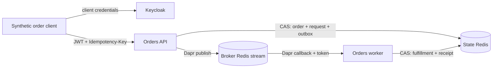

# Event-driven orders

An ASP.NET Core API accepts synthetic orders and a separate worker fulfills them through Dapr pub/sub. Keycloak authenticates clients; a durable outbox and idempotency records handle retries, duplicate events and process restarts.



The application calls the Dapr HTTP API for state and pub/sub. Both processes use a shared ETag-protected ledger. Publishing happens before removing the outbox entry, so a crash can cause another delivery. The worker commits fulfillment and its receipt together; an event replay has no additional effect on that ledger.

## Run the local demo

Requirements: Docker with Compose, Python 3.10+, and free ports **4320**, **4321**, **4322**. The stack creates only synthetic orders. It includes two Redis instances, Keycloak, the API, the worker and their Dapr containers.

```sh
python3 scripts/init-local.py
docker compose up -d --build
python3 scripts/demo.py
```

The initializer generates local credentials in ignored `.env` and `.local/realm.json` files. Run it once per fresh environment. The demo obtains genuine Keycloak client-credentials tokens without printing them and checks 401/403 behavior, validation, ownership, replay, concurrency and duplicate delivery.

```sh
# Briefly stop this project's broker/worker and restart its API/state store.
python3 scripts/demo.py --faults --output .local/integration.json

# Repeatable acceptance/completion baseline; persists additional synthetic orders.
python3 scripts/benchmark.py --requests 100 --concurrency 4 --output .local/benchmark.json

# Stop containers, retain durable volumes and generated credentials.
docker compose down
```

API: `http://localhost:4320`. Worker health: `http://localhost:4321/health/live`. Keycloak: `http://localhost:4322`. All host ports bind to loopback. Local HTTP, Keycloak development mode, and Redis without network authentication are limited to this private Docker demo network.

## Tests and implementation

With .NET SDK **10.0.401** installed:

```sh
dotnet restore --locked-mode
dotnet test --configuration Release --no-restore
```

The executable uses .NET **10.0.11**, Dapr **1.18.4**, Keycloak **26.7.4** and Redis **7.4.5**. The minimal-host API pattern follows ASP.NET Core's .NET 6 design. [Version notes](docs/versions.md) explain the runtime choice and include reference pins for the earlier stack.

| Path | Purpose |
|---|---|
| [Domain.cs](src/Orders/Domain.cs) | Validation, idempotency, CAS retry, outbox and fulfillment receipt |
| [Program.cs](src/Orders/Program.cs) | API/worker endpoints, JWT policies, ownership and callback protection |
| [DaprAdapters.cs](src/Orders/DaprAdapters.cs) | Dapr HTTP adapters and background publication |
| [Tests](tests/Orders.Tests) | Domain behavior, signed JWT boundaries and Dapr ETag compatibility |
| [API contract](docs/openapi.yaml) | HTTP requests, status codes and schemas |
| [Architecture ADR](docs/adr/001-durable-ledger.md) | Atomicity, failure boundaries and trust model |
| [Runbook](docs/runbook.md) | Recovery, diagnostics and failure matrix |
| [Validation evidence](docs/validation.md) | Commands, measured results and remaining checks |
| [Kubernetes exercise](infra/k8s/README.md) | Dapr deployments and manual Argo CD sync template |

## Scope and limits

Fulfillment is a synthetic state transition, with no payment, inventory, shipping or customer integration. The single ledger makes atomicity inspectable but rewrites the entire dataset, creates a contention point and retains orders/idempotency records indefinitely. This is a bounded learning workload, not a scalable order database. An external fulfillment side effect would need its own idempotency contract or transactional handoff.

The Redis volumes use AOF with `appendfsync always`; this protects the demonstrated process/container restarts, not disk failure or a lost Docker volume. Cluster rollout, TLS infrastructure, backup restore, sustained load and container image vulnerability scanning are not validated by the local results. The [runbook](docs/runbook.md) identifies the operational work required before broadening the exercise.

Original application code is available under the [MIT license](LICENSE). Referenced platforms retain their own licenses.
